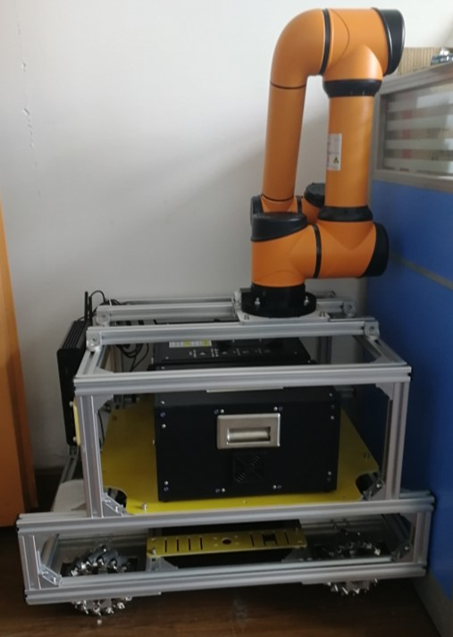
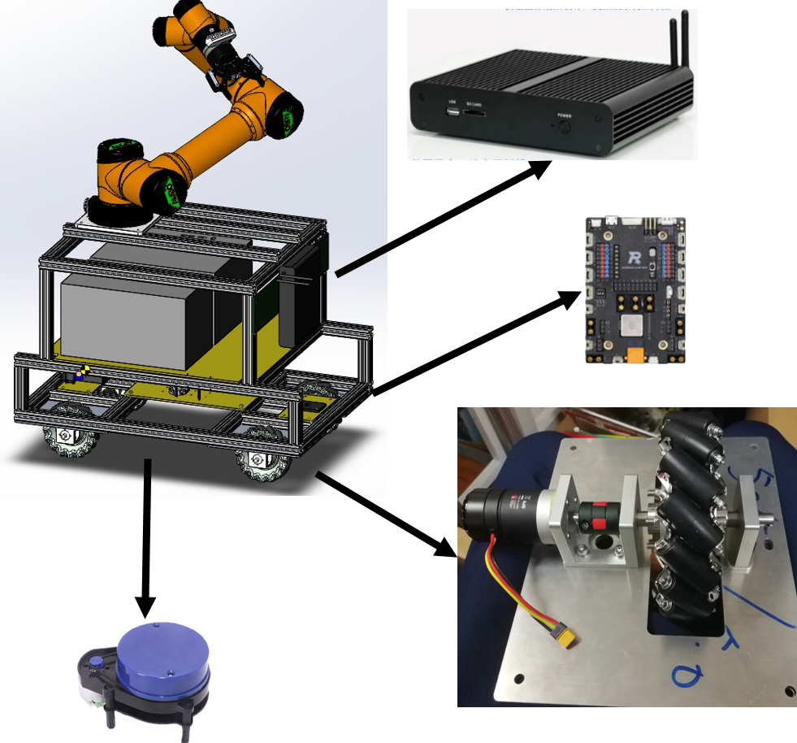

如果你需要阅读中文文档，请点击这里[中文文档](./doc/chn/)

# MOM_Robot

MOM_Robot( Mecnaum wheel based Omni-directional Mobile Robot ) is a versatile mobile robot platform and related ROS packages are provided.



video:[Gmapping and Navigation -- Youku](http://v.youku.com/v_show/id_XMzg2NDA5ODAwOA==.html?spm=a2hzp.8244740.0.0)

# Specifications

## Prerequisites

Ubuntu 16.04 and ROS Kinetic

## Component of Robot



## Package Description

| Package_name | function |
|:- |:- |
|robot_bringup|(1)rx and tx of serial port data<br/>(2)filter of imu data<br/>(3)filter of lidar data|
|robot_calib| calibration of linear velocity and angular velocity|
|robot_msgs| custom robot msg file`robot_msgs/Encoder.h` |
|robot_navigation| configuration of amcl and move_base |
|robot_slam| configuration of gmapping |
|robot_startup| bind of serial port with udev rules |
|robot_teleop| process data of keyboard |
|ydlidar| driver of EAI X4 Lidar |

# Building

In the following operation, we assume that the path of ROS's workspace is `~/project/catkin_ws`.

```
cd ~
mkdir -p project/catkin_ws/src/
git clone https://github.com/JeffYoung17/MOM_Robot.git ~/project/catkin_ws/src/
cd /project/catkin_ws/
catkin_make
```

# Started

## Keyboard Teleoperation

```
roslaunch robot_bringup teleop_key.launch
```

## SLAM

```
roslaunch robot_bringup teleop_key.launch
roslaunch robot_bringup core.launch
roslaunch robot_slam gmapping_demo.launch
rosrun map_server map_saver -f ~/project/catkin_ws/robot_slam/maps/[map_name]
```
You need to change `[map_name]`with your own map name.

## Navigation

You need to change the value of parameter ` map_file` with your map_name in the launch file `nav_demo.launch`, in order to navigate with your map.

```
roslaunch robot_bringup core.launch
roslaunch robot_navigation nav_demo.launch
```

# Acknowledgement

In the process of building MOM_Robot, I get help from many open source projects, websites, blog forums and some people. Including but limited to the followings:<br/>
[ROS.org](http://wiki.ros.org)<br/>
[ROSClub/mrobot Project](https://github.com/ROSClub/mrobot)<br/>
[marooncn/plantbot Project](https://github.com/marooncn/plantbot)
[创客智造](https://www.ncnynl.com/)<br/>
[ROS小课堂](http://i.youku.com/i/UMTUzNzkwNTA1Ng==?spm=a2hzp.8253869.0.0)<br/>
[PIBOT导航机器人](https://www.jianshu.com/u/7f508db63608)