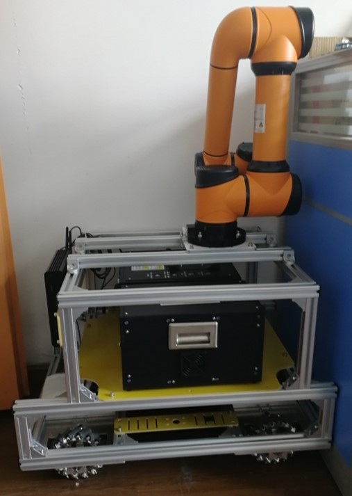

# MOM_Robot

MOM_Robot( 麦克纳姆轮全方位移动机器人 ) 是一个通用的移动机器人平台，并且提供有相关的ROS功能包。



视频：[Gmapping and Navigation -- Youku](http://v.youku.com/v_show/id_XMzg2NDA5ODAwOA==.html?spm=a2hzp.8244740.0.0)

# 说明

## 环境

Ubuntu 16.04 and ROS Kinetic

## 机器人的组成


## 功能包的描述

| 软件包 | 功能 |
|:- |:- |
|robot_bringup|(1)串口数据的接收和发送<br/>(2)imu数据的滤波<br/>(3)雷达数据的滤波|
|robot_calib|标定底盘的线速度和角速度|
|robot_msgs| 自定义的机器人消息文件robot_msgs/Encoder.h |
|robot_navigation| amcl和move_base的配置 |
|robot_slam| gmapping的配置 |
|robot_startup| 绑定串口udev rules |
|robot_teleop| 读取键盘数据 |
|ydlidar| EAI X4雷达的驱动 |

# 编译

对于以下的操作，假设ROS工作空间的路径为`~/project/catkin_ws`.

```
cd ~
mkdir -p project/catkin_ws/src/
git clone https://github.com/JeffYoung17/MOM_Robot.git ~/project/catkin_ws/src/
cd ~/project/catkin_ws/
catkin_make
```

# 开始使用

## 键盘操控

```
roslaunch robot_bringup core.launch
roslaunch robot_bringup teleop_key.launch
```

## SLAM

```
roslaunch robot_bringup teleop_key.launch
roslaunch robot_bringup core.launch
roslaunch robot_slam gmapping_demo.launch
rosrun map_server map_saver -f ~/project/catkin_ws/robot_slam/maps/[map_name]
```

你需要将 `[map_name]`修改为自己建立的地图名称。

## 导航

为了能够在你自己建立的地图上进行导航，在`nav_demo.launch`文件中，你需要将` map_file`的参数值修改为自己建立的地图名称。

```
roslaunch robot_bringup core.launch
roslaunch robot_navigation nav_demo.launch
```


# 致谢

在搭建MOM_Robot的过程中，我从许多开源项目，网页，博客论坛和一些人那里得到过帮助，包括但不限于以下内容：<br/>
[ROS.org](http://wiki.ros.org)<br/>
[ROSClub/mrobot Project](https://github.com/ROSClub/mrobot)<br/>
[marooncn/plantbot Project](https://github.com/marooncn/plantbot)<br/>
[创客智造](https://www.ncnynl.com/)<br/>
[ROS小课堂](http://i.youku.com/i/UMTUzNzkwNTA1Ng==?spm=a2hzp.8253869.0.0)<br/>
[PIBOT导航机器人](https://www.jianshu.com/u/7f508db63608)